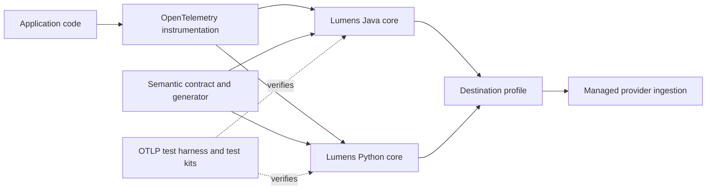

# Component Model

## Scope

This view defines the MVP component boundaries. Runtime implementations are introduced only by their assigned MVP features.

| Component | Responsibility | Feature |
|---|---|---|
| Java core API | Operations, outcomes, metrics, business events, and policies | MVP-F03 |
| Python core API | Sync/async operations, outcomes, metrics, business events, and policies | MVP-F04 |
| Spring Boot integration | Zero-touch integration and mode selection | MVP-F05 |
| FastAPI integration | Zero-touch integration and async context handling | MVP-F06 |
| Semantic contract and generator | Shared approved names, types, privacy, and generated constants | MVP-F02 |
| Business-event sinks | Validated structured business-event delivery | MVP-F07 |
| Provider profiles | Deployment-only managed provider configuration | MVP-F08 |
| Test harness and reference services | In-memory, disposable OTLP, and cross-language verification | MVP-F09 |

## Public Boundaries

Lumens preserves direct access to OpenTelemetry APIs. Provider-specific SDKs and provider-prefixed semantics do not cross into application code or the Lumens semantic contract.

## Tests

Each feature owns unit tests for its component. Cross-component behavior is deferred to MVP-F09 and full regression automation to MVP-F10.
