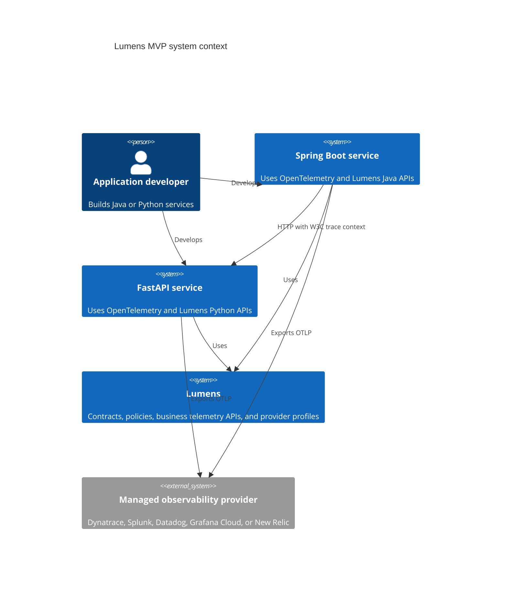

# System Context

## Scope

This view describes the MVP Java and Python backend accelerator and provider-managed ingestion. It excludes browser telemetry, an organization-managed Collector, AI agent instrumentation, and provider dashboard automation.

## Ownership

| Boundary | Owner |
|---|---|
| Business behavior and explicit business events | Application team |
| Lumens libraries, semantic contract, policies, and test kits | Lumens/Deloitte delivery team |
| Deployment configuration and secret injection | Client platform or application operations team |
| Ingestion availability, storage, dashboards, alerts, and retention | Provider and client operations team |

## Security And Failure Boundaries

Applications receive provider credentials only through deployment configuration. Lumens must not log credentials or automatically collect payloads. A provider or network outage may lose telemetry, but must not fail application work.

## Tests

MVP-F09 validates connected Java/Python traces, propagation, and provider-failure isolation. MVP-F08 validates destination-profile boundaries.
