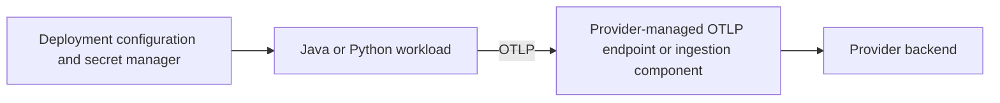

# Deployment Models

## MVP: Provider-Managed Ingestion

The client injects destination configuration and credentials. The provider operates ingestion and backend services. Lumens operates no deployed Collector, queue, gateway, or shared credential service in the MVP.

## Development And CI

In-memory exporters, disposable containers, or disposable OTLP receivers may inspect normalized telemetry. These tools are test infrastructure only and are never a required production deployment component.

## Phase 1: Optional Organization-Managed Gateway

An organization may later operate a gateway for routing, queues, sampling, redaction, dual export, and centralized credentials. Adopting this model requires explicit operational ownership and does not change application APIs or semantic contracts.

## Tests

MVP-F08 validates profile configuration. MVP-F09 uses disposable test infrastructure. Production gateway tests are outside the MVP.
