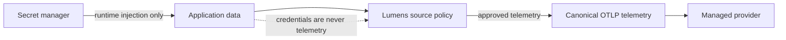

# Security Boundaries

## Data Rules

Lumens rejects secrets and prohibits automatic capture of payloads, authorization headers, cookies, tokens, credentials, raw user IDs, and raw tenant IDs. High-cardinality values are not metric dimensions. Registered baggage is deny-by-default and never authorizes access.

## Trust Boundaries

| Boundary | Requirement |
|---|---|
| Application to Lumens | Only registered custom fields cross into Lumens policies |
| Lumens to provider | Only canonical OpenTelemetry and approved `lumens.*` semantics are exported |
| Secret manager to workload | Secrets are injected at runtime and omitted from logs, diagnostics, fixtures, and telemetry |
| Future browser support | Browser bundles cannot contain private provider credentials |
| Future GenAI support | Prompts, responses, customer data, and provider tokens remain outside model input by default |

## Defense In Depth

Source-level enforcement is primary. Provider-side redaction is supplemental and cannot substitute for safe instrumentation.

## Tests

MVP-F02 validates policy metadata, MVP-F03/F04 enforce it in core APIs, and MVP-F09 verifies forbidden markers are absent from captured telemetry.
