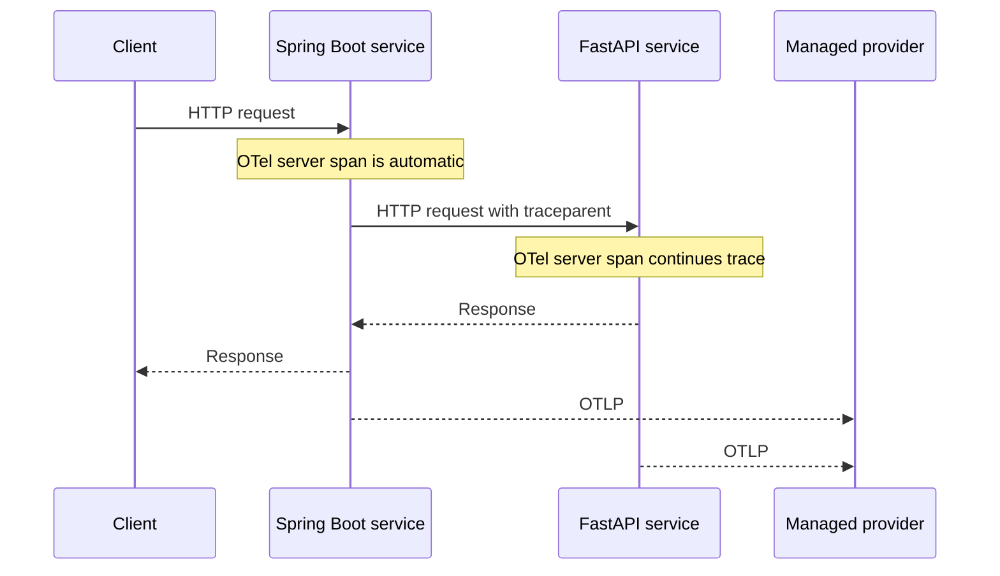

# Telemetry Flows

## Automatic Technical Telemetry

Lumens must not wrap supported server or client boundaries just to create duplicate spans.

## Business Telemetry

An application explicitly starts a custom internal operation only when it represents distinct work. It explicitly sets a bounded business outcome and emits registered business events at the relevant domain decision point. Lumens validates fields against the semantic contract and correlates events with the active trace when one exists.

## Provider Switching

Provider selection is deployment configuration: standard `OTEL_*` settings point applications at a provider Agent, customer-managed Collector, provider-supported component, or direct endpoint. Direct OTLP headers come from the client secret manager through `OTEL_EXPORTER_OTLP_HEADERS`. `LUMENS_PROVIDER` is optional metadata, not an export requirement. Switching a certified destination changes deployment configuration, not application source code. Provider-owned assets such as dashboards and alerts are recreated separately.

## Failure Isolation

Telemetry creation, validation, and export failures are suppressed or reported through bounded diagnostics. They must not alter application responses or throw into application control flow.

## Tests

MVP-F05 and MVP-F06 test automatic boundaries. MVP-F07 tests business events and policy enforcement. MVP-F09 tests propagation, provider failure, and switching behavior.
